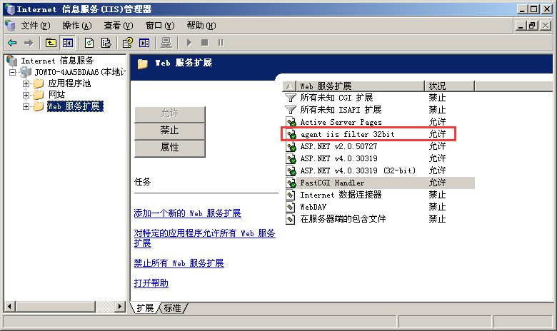
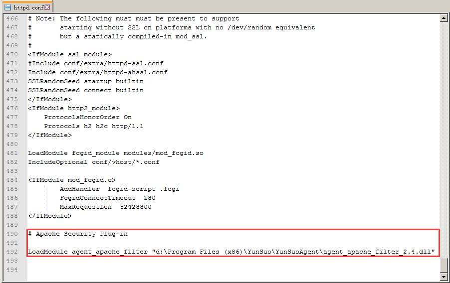

# 卸载云锁网站无法访问的问题

卸载云锁后遇到网站打不开问题，在IIS6上请检查IIS 筛选器、IIS通配符应用程序映射以及Web服务扩展这3个地方是否存在云锁插件。

网站-属性-ISAPI筛选器

IIS通配符应用程序映射

Web服务扩展

在IIS7和IIS8上请检查IIS模块里是否含有云锁插件

IIS模块

在Apache上检查配置文件httpd.conf是否还有云锁插件配置信息

如果存在则删除这些插件重启IIS或Apache服务即可。

