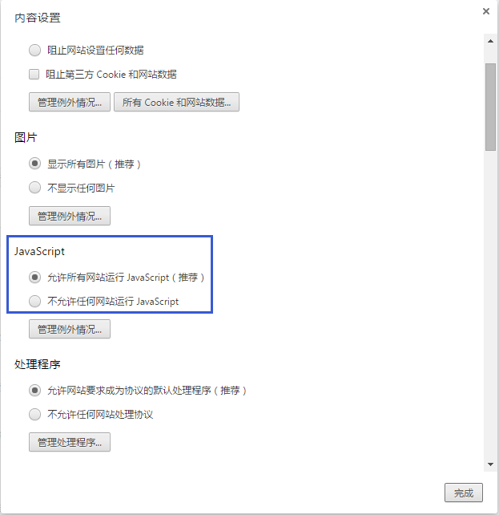
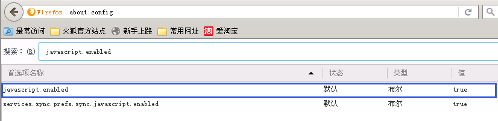

# 云锁开启“抗CC攻击”后，网站访问一直跳转的问题

用户在开启了“抗CC攻击”中级后，访问网站会出现一直重复跳转并会显示提示信息的问题。出现这样的状况一般提示信息中的状况导致的。

1.  请确保浏览器没有禁止发送cookie的情况。

    **IE：**打开Internet选项，隐私项的高级设置，检查是否接受Cookie。

    

    **Chrome：**打开设置页面，在高级设置中找到隐私设置，检查内容设置中的Cookie是否被允许。

    

    **Firefox：**打开选项，隐私项中检查是否接受Cookie。 
2.  请确保浏览器可以正常执行JavaScript脚本的情况

    **IE：**打开Internet选项，隐私项的高级设置，检查是否运行执行JavaScript脚本。

    

    **Chrome：**打开设置页面，在高级设置中找到隐私设置，检查JavaScript是否被允许运行。

    

    **Firefox：**在地址栏输入about:config，打开的页面中输入javascript.enabled；查找到javascript.enabled后检查值是否为ture。

    
