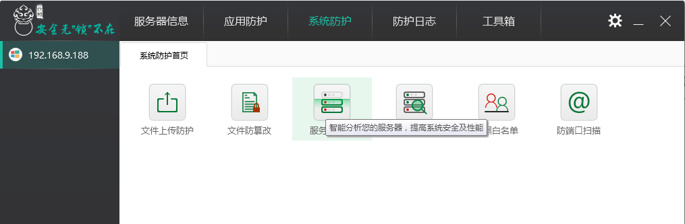
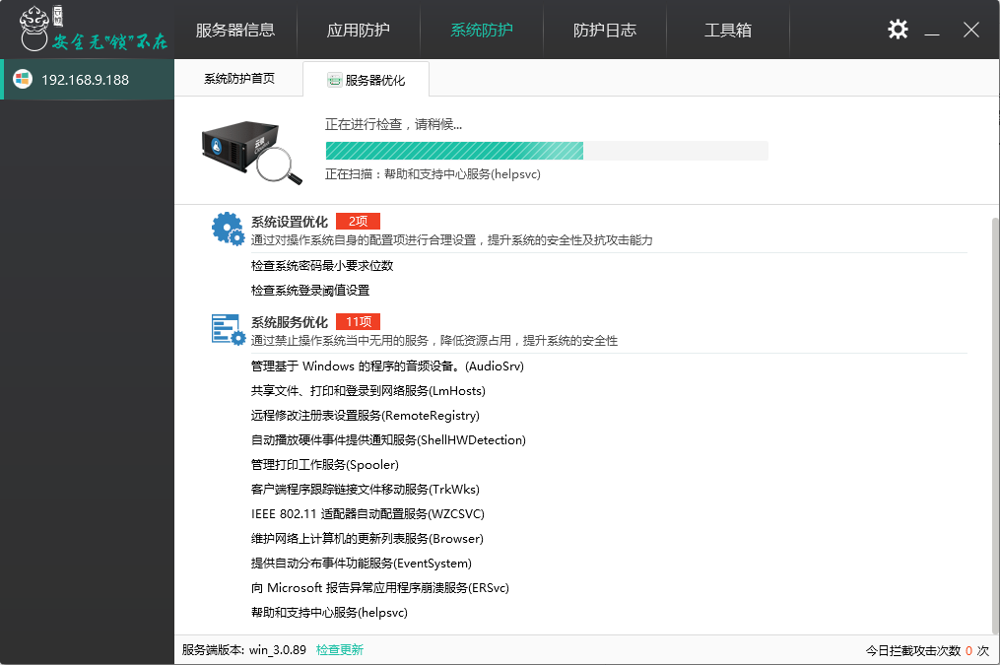

# “服务器优化”功能设置

服务器系统默认会开启很多不常用的服务和设置，这些服务和设置既会给服务器造成安全隐患，也会影响服务器使用性能。云锁“服务器优化”功能可以分析您的服务器，对不常用的服务和设置进行优化，提高服务器的安全及性能。

“系统防护”下打开“服务器优化”进行扫描。

扫描后列出具体项，对列出的项可以进行逐个优化或一键优化；如果有些项不需要优化则可以选择忽略。

对于忽略和优化的项可以通过“已优化项”和“已忽略项”查看；同时还可以进行取消忽略项和恢复优化项。同时针对多个项还可以全部取消和恢复。

