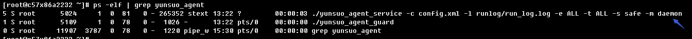
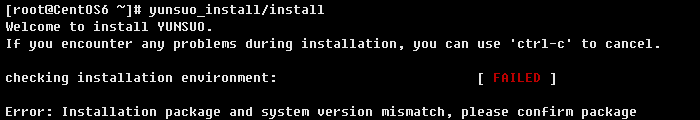

# Linux 服务器端

> **\[warning\] 注意**
>
> 安装前需要保证服务器端与云锁云中心的443端口通信保持畅通，可以通过命令`telnet apiv3.yunsuo.com.cn 443`检查是否连通，连通则按照下面步骤进行安装；如不通则检查防火墙规则或云主机安全策略，将出站的443端口放开。PS：提示telnet未安装可通过百度查询安装方法。

* [安装](linux.md#安装云锁)
  * [快速安装](linux.md#快速安装)
  * [分步安装](linux.md#分步安装)
* [查看云锁是否运行](linux.md#查看云锁是否运行)
* [云锁相关命令](linux.md#云锁服务相关命令)
* [卸载](linux.md#卸载云锁)
* [常见问题](linux.md#faq)

## 安装云锁

> **\[info\] 提示** 
>
> 如曾经下载过云锁安装包，则将旧的云锁安装包及安装目录删除**（rm -rf yunsuo\_\*）**后再安装。Ubuntu系统的用户需要切换到root权限进行安装。

### 快速安装

**CentOS/Redhat**

x86：`wget http://download.yunsuo.com.cn/v3/yunsuo_agent_32bit.tar.gz && tar xvzf yunsuo_agent_32bit.tar.gz && chmod +x yunsuo_install/install && yunsuo_install/install`

x64：`wget http://download.yunsuo.com.cn/v3/yunsuo_agent_64bit.tar.gz && tar xvzf yunsuo_agent_64bit.tar.gz && chmod +x yunsuo_install/install && yunsuo_install/install`

**Ubuntu**

x86：`wget http://download.yunsuo.com.cn/v3/yunsuo_agent_32bit.tar.gz && tar xvzf yunsuo_agent_32bit.tar.gz && chmod +x yunsuo_install/install && sudo yunsuo_install/install`

x64：`wget http://download.yunsuo.com.cn/v3/yunsuo_agent_64bit.tar.gz && tar xvzf yunsuo_agent_64bit.tar.gz && chmod +x yunsuo_install/install && sudo yunsuo_install/install`

### 分步安装

1. 下载云锁安装包。

   x86：`wget http://download.yunsuo.com.cn/v3/yunsuo_agent_32bit.tar.gz`

   x64：`wget http://download.yunsuo.com.cn/v3/yunsuo_agent_64bit.tar.gz`

2. 解压文件，得到安装包文件。

   x86：`tar zxvf yunsuo_agent_32bit.tar.gz`

   x64：`tar zxvf yunsuo_agent_64bit.tar.gz`

3. 给云锁安装文件赋予可执行权限。

   ```text
   chmod +x yunsuo_install/install
   ```

4. 执行安装，直到提示“Install Yunsuo Success.”安装完成。

   CentOS：`yunsuo_install/install`

   

   Ubuntu：`sudo yunsuo_install/install`

5. 添加服务器到云中心。

   ```text
   /usr/local/yunsuo_agent/agent_smart_tool.sh -u cloud_name -p cloud_passwd
   ```

   **PS:**`cloud_name：云中心账户名；cloud_passwd：云中心登录密码`

   

6. 安装完成后通过[PC端](pc.md)进行管理。

## 查看云锁是否运行

```text
 ps -ef | grep yunsuo_agent
```



## 云锁服务相关命令

**云锁启动/停止/重启/状态**

```text
service yunsuo start/stop/restart/status
/etc/init.d/yunsuo start/stop/restart/status
```

## 卸载云锁

```text
/usr/local/yunsuo_agent/uninstall
```

## FAQ

1. 提示“Error：Installation package and system version mismatch，please config package”的问题

   

   提示这个错误是因为当前安装的云锁与系统的位数不相符，如32位的系统安装了64位的安装包；此时再下载32位的安装包进行安装即可。

2. 提示“Error：Detected SELinux opening，close and then install.”的问题

   

   是因为SELinux未关闭导致的，修改/etc/sysconfig/selinux文件，将enforcing改为disabled，重启服务器即可。如已经是disabled则直接重启服务器。

   ```text
   # vi /etc/sysconfig/selinux
   ```

   

