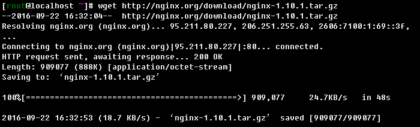
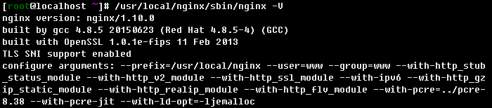

# Nginx/Tengine 自编译说明

安装云锁的时候，云锁会自动适配nginx版本，使用我们已经预编译好的包含防护模块的nginx文件替换掉您当前系统中使用的nginx文件。卸载时，会将备份的系统原始nginx文件替换回来。因此，云锁可保护使用nginx搭建的网站，开创了这个领域的先河。

当nginx更新或用户的nginx添加（--add-moudel）了第三方模块时需要用户手工加载云锁的防护模块进行防护。通常在安装时云锁会提示存在第三方模块，且PC端也会有显示需要编译。


* [安装防护模块](nginx.md#安装)
* [卸载防护模块](nginx.md#卸载)
* [常见问题](nginx.md#faq)

## 安装

> **\[info\] 友情提示**
>
> 在安装防护模块前先重启一次Nginx的服务，确保业务重启后可以正常运行，然后再安装云锁防护模块。

1. 编译前先将已经安装的Nginx文件进行备份，通过ps命令查看nginx文件的路径。以下所有步骤都以自身nginx路径为准。

   ```text
   # ps -elf | grep nginx
   ```

   

   ```text
   # cd /usr/local/nginx/sbin/
   # cp nginx nginx.bak
   ```

   

2. 过步骤1查看的路径跟-v参数查看当前Nginx版本，如有源码包则忽略此步骤。无源码包则到[Nginx官网](http://nginx.org/en/download.html)下载Nginx源码包，源码包需与自己的当前Nginx版本匹配（假设当前Nginx版本为1.10）。宝塔面板Nginx源码路径：/www/server/nginx/src/；Oneinstack的Nginx源码路径在oneinstack目录下：oneinstack/src/。

   ```text
   # /usr/local/nginx/sbin/nginx -v
   ```

   

   ```text
   # wget http://nginx.org/download/nginx-1.10.1.tar.gz
   ```

   

3. 解压nginx源码包

   ```text
   # tar zxvf nginx-1.10.1.tar.gz
   ```

   

4. 由于其默认不支持post过滤，所以需要修改Nginx文件。1.8.0 版本以下修改源码目录下ngx\_http\_upstream.c文件（Nginx 1.8.0 及以上版本和**Tengine**跳过该步骤）。在`static void ngx_http_upstream_init_request(ngx_http_request_t \*r);`行上方添加：`int ngx_http_yunsuo_post_in_handler(ngx_http_request_t *r);`和在`ngx_http_upstream_init_request`后，添加：

   ```bash
   if (ngx_http_yunsuo_post_in_handler(r)) {
       return;
   }
   ```

   ```text
   # cd nginx-1.8.1/src/http/
   # vi ngx_http_upstream.c
   ```

   ```bash
   --------------------下面这段是添加的----------------
   int
   ngx_http_yunsuo_post_in_handler(ngx_http_request_t *r);
   --------------------------------------------------
   static void
   ngx_http_upstream_init_request(ngx_http_request_t *r)
   {
   ngx_str_t                      *host;
   ngx_uint_t                      i;
   ngx_resolver_ctx_t             *ctx, temp;
   ngx_http_cleanup_t             *cln;
   ngx_http_upstream_t            *u;
   ngx_http_core_loc_conf_t       *clcf;
   ngx_http_upstream_srv_conf_t   *uscf, **uscfp;
   ngx_http_upstream_main_conf_t  *umcf;
   --------------------下面这段是添加的----------------
   if (ngx_http_yunsuo_post_in_handler(r)) {
       return;
   }
   --------------------------------------------------
   if (r->aio) {
       return;
   }
   ```

   

5. 下载云锁防护模块压缩包

   ```text
   # cd /root/
   # wget https://codeload.github.com/yunsuo-open/nginx-plugin/zip/master -O nginx-plugin-master.zip
   ```

   

6. 解压云锁防护模块压缩包nginx-plugin-master.zip

   ```text
   # unzip nginx-plugin-master.zip
   ```

   

7. 获取当前云锁模块所在目录的全路径

   ```text
   # cd nginx-plugin-master/
   # pwd
   ```

   

8. 查看当前nginx加载的模块，在编译加载云锁防护模块的时候仍需加载这些模块

   ```text
   # /usr/local/nginx/sbin/nginx –V
   ```

   

9. 进入nginx源码目录，对nginx进行编译；编译时在第8步获取的nginx原有模块后添加云锁防护模块，模块路径为第7步获取的云锁防护模块源码全路径“/root/nginx-plugin-master”

   ```text
   # cd nginx-1.10.1/
   # ./configure --prefix=/usr/local/nginx --with... --add-module=/root/nginx-plugin-master
   ```

   

10. Nginx1.8.0 以上和 Tengine 2.2.0 则需要修改objs/Makefile文件和objs/ngx\_modules.c来支持post过滤和内容过滤。

    首先，在Makefile文件中的`CFLAGS=...-Werror -g`后追加宏定义 `-DHIGHERTHAN8`

    ```text
    # vi objs/Makefile
    CFLAGS =  -pipe  -O -W -Wall -Wpointer-arith -Wno-unused-parameter -Werror -g -DHIGHERTHAN8
    ```

    

    其次，将ngx\_modules.c中的`&ngx_http_yunsuo_module,`向下移动到`ngx_http_userid_filter_module`和`ngx_http_headers_filter_module`之间。\(已在此之间的则可忽略\)

    ```text
    # vi objs/ngx_modules.c
    ```

    ```bash
    ngx_module_t *ngx_modules[] = {
       &ngx_core_module,
       ......
       &ngx_http_upstream_keepalive_module,
       &ngx_http_upstream_zone_module,
    -----------下面这行向下移动----------------   
       &ngx_http_yunsuo_module,
    ------------------------------------------     
       &ngx_http_stub_status_module,
       ......
       &ngx_http_userid_filter_module,
    ---------------移动到该位置-----------------  
       &ngx_http_yunsuo_module,
    -------------------------------------------
       &ngx_http_headers_filter_module,
       &ngx_http_copy_filter_module,
       &ngx_http_range_body_filter_module,
       &ngx_http_not_modified_filter_module,
       NULL
    };

    char *ngx_module_names[] = {
       "objs/ngx_modules.c" 186L, 6441C
       ......
    };
    ```

    

11. configure完成后进行make（如原本无nginx，make后还需make install）

    ```text
    # make
    ```

    

12. make完成后将系统中原有的nginx用重新编译生成的nginx文件替换，替换后重启nginx使新编译nginx生效

    ```text
    # rm -rf /usr/local/nginx/sbin/nginx
    # cp objs/nginx /usr/local/nginx/sbin/
    # service nginx restart
    ```

    

13. 到此通过PC端连接到服务器端，在PC端的界面上可以看到已识别nginx插件。

    

## 卸载

使用nginx.bak文件替换掉自编译的nginx文件，替换后重启Nginx。以下nginx路径与上述安装路径一致，实际以自身nginx路径为准。

```text
   # cd /usr/local/nginx/sbin/ 
   # rm -rf nginx
   # mv nginx.bak nginx
   # service nginx restart
```

## FAQ

1. 什么情况下需要自己编译云锁的nginx模块？

   1） 当您的nginx使用了第三方或者自己开发的模块的时候，需要编译云锁的nginx模块。您可以通过nginx -V命令查看输出的信息里是否包含了--add-module=的字样 \(例如：--add-module=../ngx\_cache\_purge-1.3说明使用了ngx\_cache\_purge-1.3第三方模块\)

   2） 当使用tengine的时候，需要编译云锁的nginx模块

   3） 当前使用的nginx版本比云锁适配的nginx版本高的时候，需要自己编译云锁的nginx模块

2. 卸载云锁后nginx需要重新编译吗？

   不需要，云锁的nginx模块会判断防护模块是否安装，如果不安装则不生效。当然您也可以替换回之前的nginx

3. 编译时可能出现的几种错误解决方法

   ```text
    1）遇如下错误信息 ： cc1: all warnings being treated as errors， 编译器把   警告信息作为错误处理了   
       解决： 修改 objs/Makefile
       把CFLAGS = -pipe -O -W -Wall -Wpointer-arith -Wno-unused-parameter    -Werror -g修改为：CFLAGS = -pipe -O -W -Wall -Wpointer-arith -Wno-unused-parameter -g即去掉-Werror选项
       重新 make， 注意是重新make 而不是重新 ./configure

    2) 遇如下错误信息：undefined reference to `dlclose'，由于编译器版本过高，需要在链接时，加入-ldl 选项
       解决： 修改 objs/Makefile
       搜索 -lpthread，定位到该行结束，加入 -ldl   
       形如 -lpthread -lcrypt 修改为 -lpthread -lcrypt -ldl
       重新 make，注意是重新make而不是重新./configure
   ```

