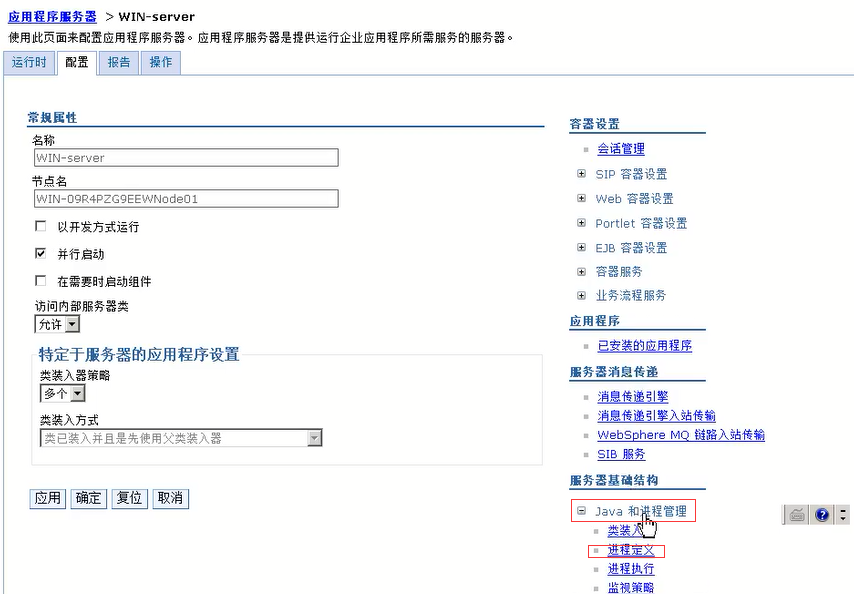
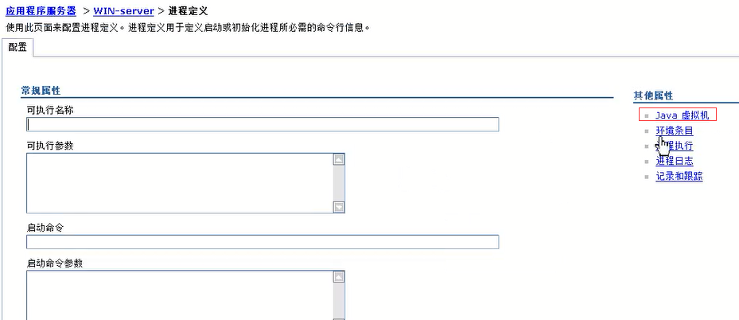
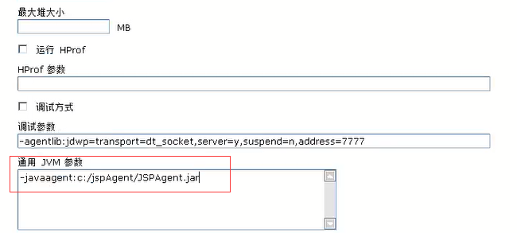
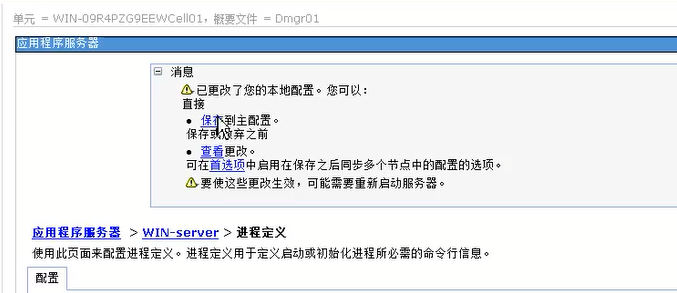
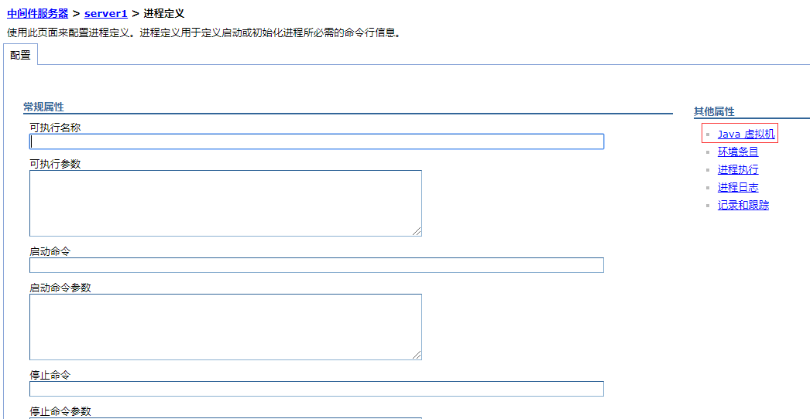
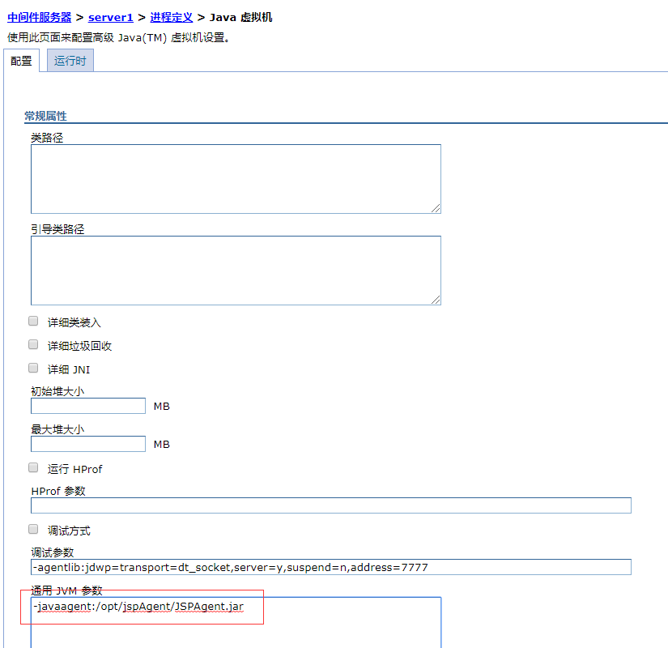
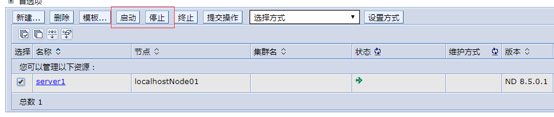

# WebSphere安装

> **\[info\] 建议**
>
> 安装前重启一次Web的服务，确保业务重启后可以正常运行，然后再安装云锁防护模块；同时将要修改的配置文件进行备份。

**Web容器使用的Java（jdk或jre）的版本需 1.6 及以上，暂不支持“敏感词过滤”和“防多线程下载”功能。**

* [Windows安装说明](websphere.md#windows)
* [Linux安装说明](websphere.md#linux)

## Windows

1）拷贝`jspAgent`目录到`c:`下。

2） 打开`dmgr`控制台，服务器-&gt;服务器类型-&gt;`WebSphere Application Server`


3）点进你要配置`javaagent`的`Server`


4）配置-&gt;服务器基础结构-&gt;`Java`和进程管理-&gt;进程定义



5）其他属性-&gt;`Java`虚拟机



6）通用`JVM`参数：配置`javaagent`



7）保存到主配置



8）重启`Server`：建议从服务端手动重启，以便当时查看是否出错，通常是

```text
stopServer.bat Server
start Server.bat Server
```


## Linux

1）拷贝`jspAgent`目录到`/opt`下。

2）`console`端：`http://192.168.8.122:9060/ibm/console/unsecureLogon.jsp`

3）“服务器”-&gt;“所有服务器”，找到要安装的`webserver`（本例为：`server1`）


4）点击`server1`进入设置：“`Java`和进程管理”-&gt;“进程定义”


5）进入 “进程定义”页面



6）点击“`JAVA`虚拟机”：配置 “通用`JVM`参数”框填写:`-javaagent:/opt/jspAgent/JSPAgent.jar`，点击“应用”保存




7）保存到主配置


8）重启`webserver`



