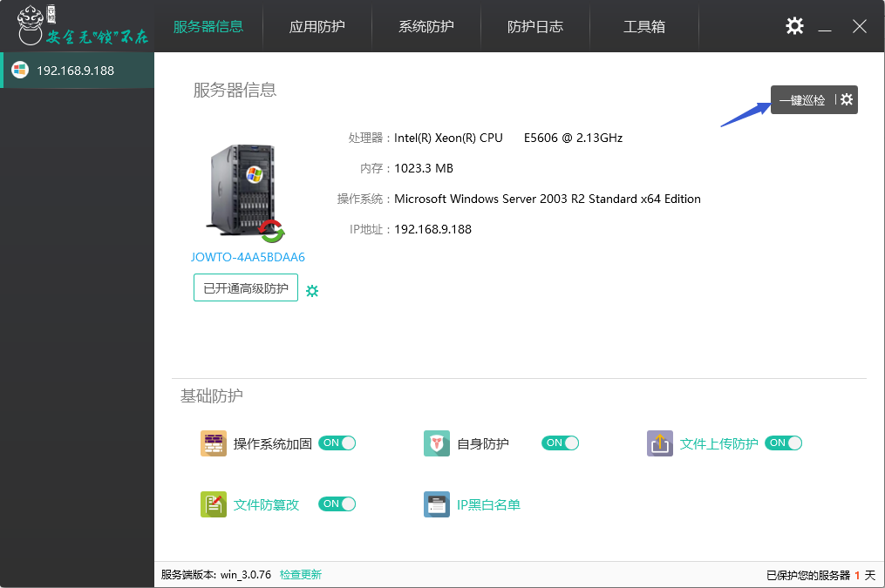
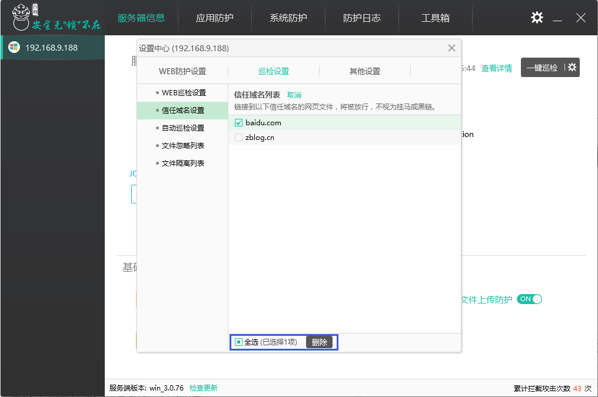

# “一键巡检”功能说明

“巡检”主要是对服务器和网站进行全面扫面，对服务器和网站存在的安全隐患进行检查并修复。服务器安全主要针对计划任务、账户（登录账户、克隆账户、隐藏账户）及云锁各功能开启状态进行检查和修复；网站安全主要针对网页木马、网站挂马和暗链黑链进行检查和修复。

登录云锁，打开具体服务器信息界面，在右边可以看到巡检功能。

巡检结束后会给出一个详细的巡检结果并对当前的安全情况给出分数；返回首页还会看到巡检的时间和对巡检的概述。

针对查出的问题，既可以“一键修复”也可以针对具体的问题进行详细操作。选择查看详情可以看到该问题项的具体内容，并可将其下载到本地进行分析；对于可疑外链和网站挂马，如果是可信任的项则加入信任域。

选择“一键修复”后，针对外链和挂马进一步判断是否为信任项，将非信任项勾选后进行“一键修复”。修复过程中还可以看到修复的进度。

为避免误操作而导致一些不需要修复的项被修复掉，云锁在巡检设置里提供了隔离列表，已修复的项都可以在隔离列表中看到并对误操作的项进行还原。同时也可以对已确认的项进项删除。

除了“一键修复”外，还可以针对单条危险项进行修复、忽略和查看详情。

对于当前阶段不需要巡检到的项可以进行忽略，这样在下次巡检的时就不会巡检该项。当需要巡检并修复时，可以从巡检结果中的已忽略项中取消，或者在巡检设置的文件忽略列表中进行取消

点击“查看详情”可以看到问题项的具体编码内容，并且可以将问题项下载到本地进行分析。

巡检的可疑外链中会有用户自定义的友链等域名，对于这样的域名可以点击加入信任域中，以后巡检中针对这样的域名不再列出。而加入信任域名的项在“设置-巡检设置-信任域名设置”中可以看到；当不再信任时，可以进行删除。

巡检时会占用一部分系统资源，云锁提供了2种巡检模式（空闲模式、极速模式），用户可以根据自己服务器的实际情况在“Web巡检设置”中选择巡检的模式。同时还可以自定义巡检的站点（默认为所有站点）及文件类型。

云锁支持自动巡检，可以设置在服务器资源占用较小的时间内进行巡检。

考虑到文件较多时巡检时间较长，用户无法一直待在机器旁，巡检意外中断而不知；云锁特意添加了巡检中断的友情提示，登录云锁就可以看到。

