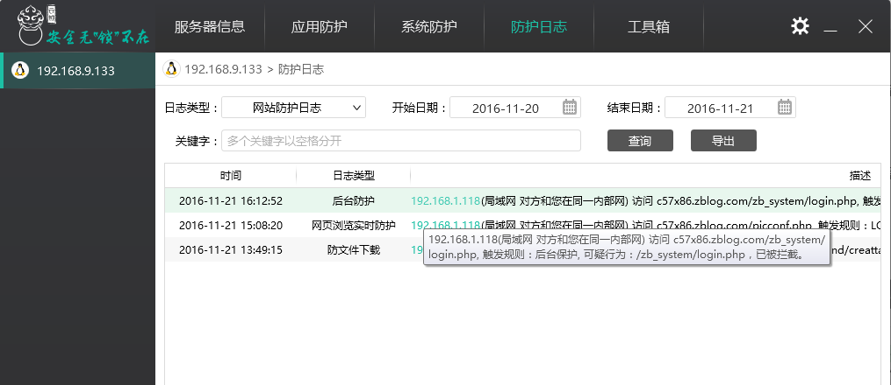

# “网站后台防护”功能设置

黑客通过常用网站的默认后台/admin.asp、/login.php等路径猜测、获取用户网站的后台路径，然后通过其他手段获取网站管理员的用户名、密码登录管理界面，威胁网站安全。

云锁“网站后台防护”功能通过重定向网站后台路径，使黑客无法获取网站后台的路径的方法保护网站安全。

通过“应用防护”中的Web防护（IIS、Apache、Nginx等）进入Web应用设置，打开“网站后台防护”功能。

进入“网站后台防护”界面，配置后台防护规则。网站原始后台地址是指网站真实的后台地址，而重定向地址是指用户自定义的虚拟的后台地址；设置后只有使用自定义的虚拟地址才可以访问网站后台地址进行网站后台登录。

通过原始真实网站后台直接访问网站后台登录界面会自动跳转到404页面，可以在云锁的防护日志查看到相应的防护信息。

只有通过用户自定的虚拟地址访问才会跳转到真实的后台页面进行登录。同时防护日志会记录访问成功日志，如果非本人访问则说明虚拟后台已被他人获知，请及时更改自定义后台。

