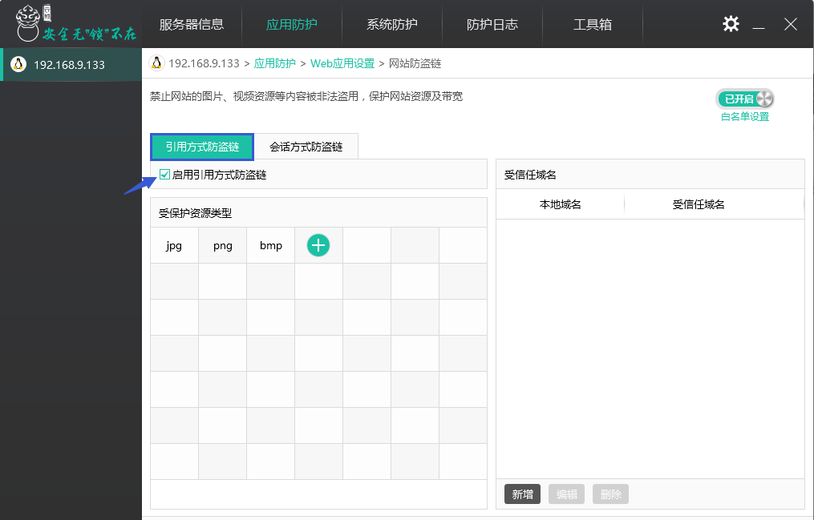
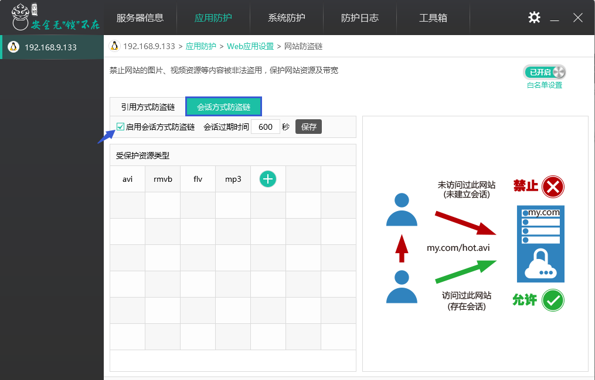
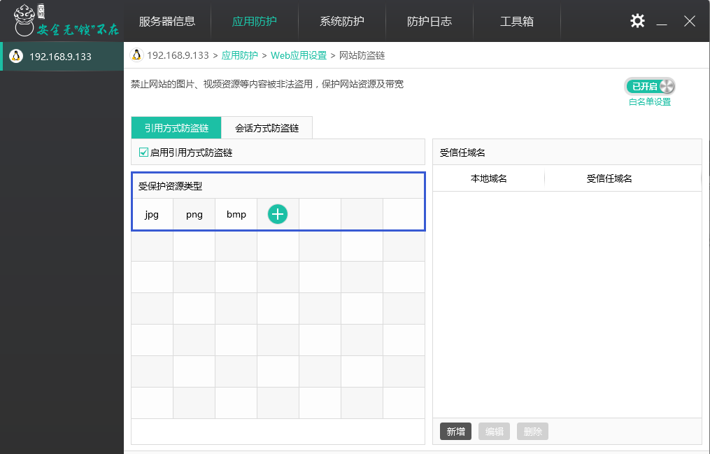
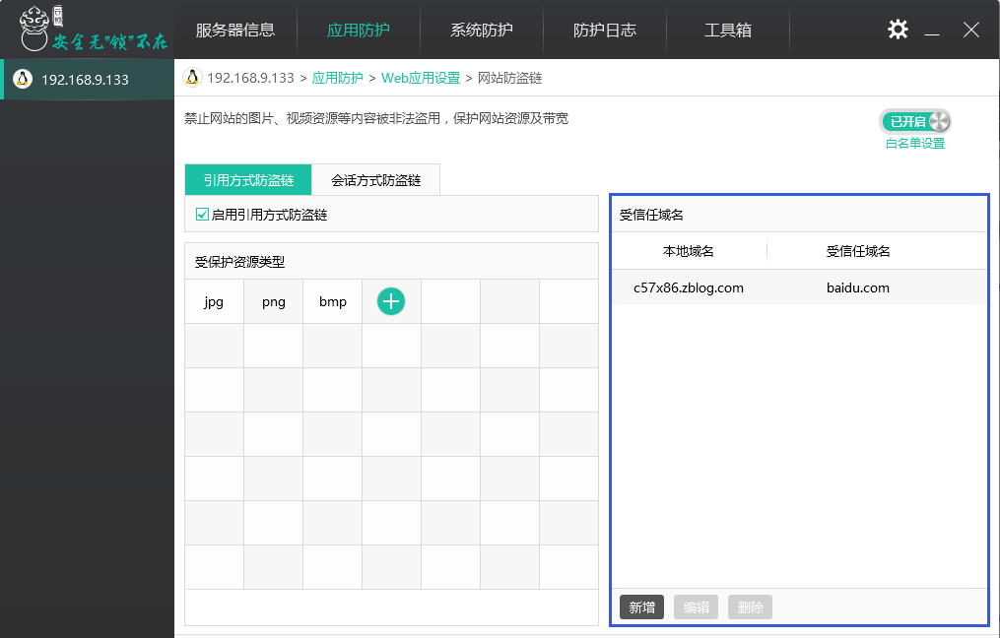
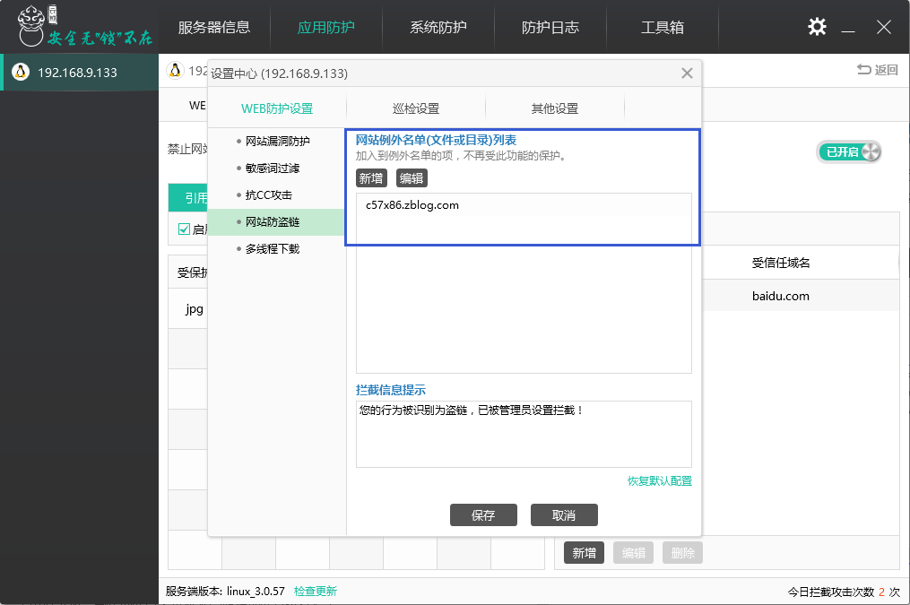
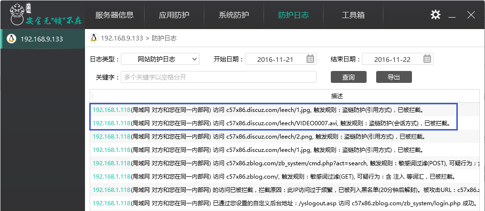

# “网站防盗链”功能设置

盗链是指服务提供商自己不提供服务的内容，通过技术手段绕过其它有利益的最终用户界面(如广告)，直接在自己的网站上向最终用户提供其它服务提供商的服务内容，骗取最终用户的浏览和点击率。受益者不提供资源或提供很少的资源，而真正的服务提供商却得不到任何的收益。云锁通过“网站防盗链”功能更有效的保护用户的网站资源。

云锁提供了“引用方式”和“会话方式”两种盗链防护方式。“引用方式”主要用于防止图片、下载资源等类型文件被盗链（如JPG、GIF图片，RAR、ZIP等下载资源）。“会话方式”主要用于防止流媒体类型文件被盗链（如MP3，WMA等在线播放资源）。

通过“应用防护”中的Web防护（IIS、Apache、Nginx等）进入Web应用设置，打开“网站防盗链”功能。

进入“网站防盗链功能”，可以看到防盗链的2种方式。

**1） 引用方式**

指通过判断referer变量值来判断图片或资源的引用是否合法，只有在设定的允许范围内的referer才能访问指定的资源，从而实现了防盗链的目的。

**2） 会话方式**

所谓会话防盗链方式，是以判定浏览器为原则，通过假设用户使用浏览器正常浏览站点，然后向其发送动态生成的Session ID，在得到基于浏览器才能响应的返回后进而确认为其为浏览器。同时通过用户相关的动态的Session ID生成和过期，防止暴力破解。使得下载工具等非浏览器程序无法进行盗链行为，同时结合引用反盗链方式可达到近乎完美的防盗链能力。

根据会话方式描述，我们针对浏览器访问用户资源时产生的cookie加入了过期时间，浏览器关闭时过期时间不会被删除，当浏览器访问用户资源超过过期时间时则需要产生一个新的cookie，否则判定为盗链。

为了更人性化的设置，用户可以自定义添加、删除保护资源类型，同时需要注意的是保护资源类型扩展名不需要“.”符号，只需填写纯粹的扩展名即可。

为了用户使用方便，同时为了避免搜索引擎抓取图片被拦截；云锁“引用方式防盗链”可以对信任域名添加白名单，信任域名将不在网站资源防盗链功能的防护之内；用户可以新增、编辑、删除受信任域名。

对于设置多个站点的服务器用户，为了不影响其它对外开通连接的网站正常运营，可在设置中心添加、删除网站白名单对不受防护的站点进行设置。

除上述人性化的设置外，云锁还提供被盗链时服务器返回的友情提示的文字内容的设置。

当通过网站访问被盗连的资源时，浏览器会返回拦截页面提示；同时在防护日志可以看到拦截的盗链日志。

