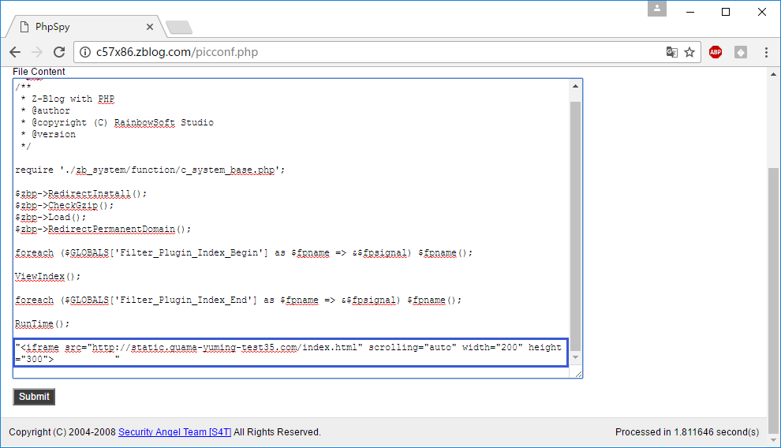
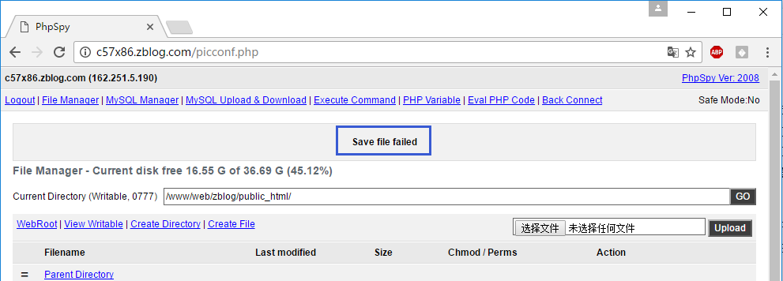
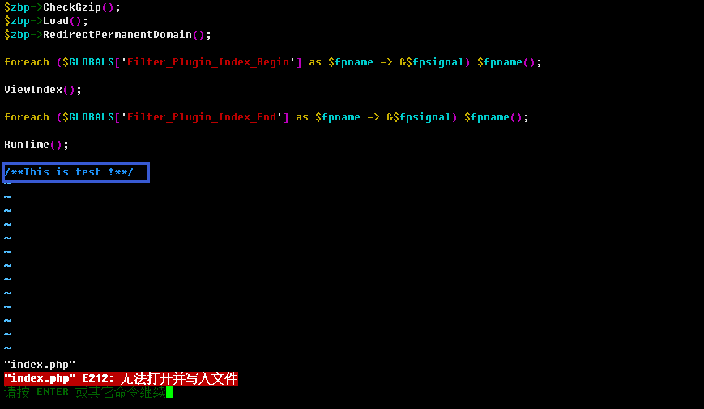
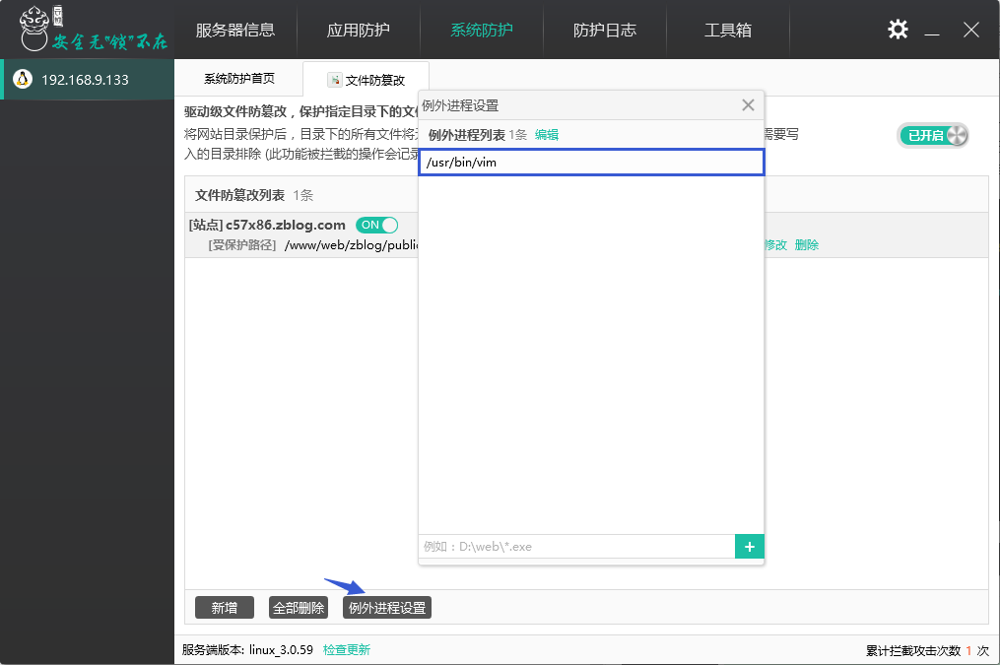
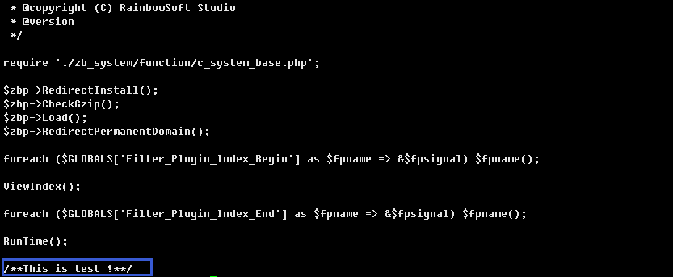
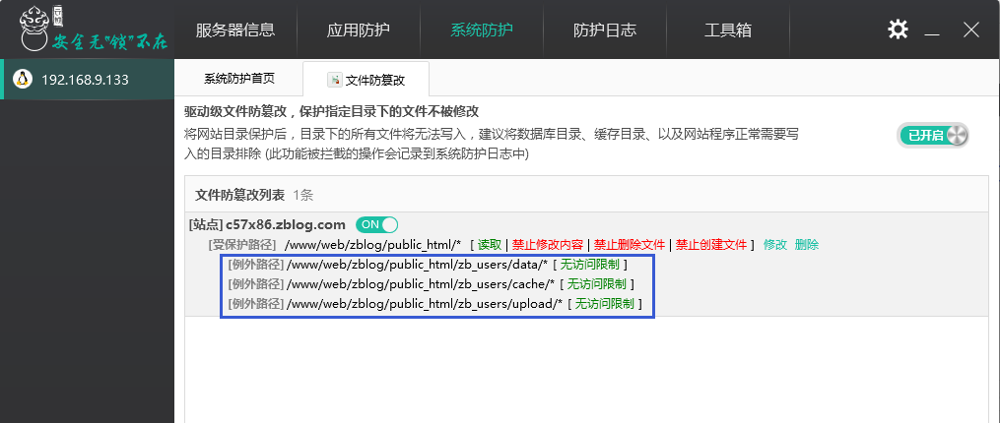

# “文件防篡改”功能设置

一些用户为了提高网站的PR值通常会在访问量较高的网站中隐藏自己的链接，并且将链接做的非常隐蔽，在短时间内不易被搜索引擎察觉。而黑客往往会通过各种手段获得网站管理员账号，然后登录网站后台，通过数据库备份/恢复或者上传漏洞获得一个webshell。利用获得的webshell修改网站页面的内容，向页面中加入恶意转向代码。也可以直接通过弱口令获得服务器或者网站FTP，然后直接对网站页面直接进行修改。

“文件防篡改”功能通过内核加固技术保护网站目录及文件不被修改；甚至即使被获取了权限上传了Webshell也无法对网站的文件进行修改。

通过“系统防护”中进入并开启“文件防篡改”功能，添加受保护的路径，可以根据网站文件实际情况选择是否运行创建和删除文件。用户则可以根据自己的实际情况选择保护网站目录或文件。

下面的例子是将c57x86.zblog.com站的根目录添加为保护目录。

通过FTP向保护的目录下上传Webshell，会被阻止上传。

在云锁防护日志的“系统防护日志”中可以看到创建文件失败的日志。

为了验证保护效果，我们假设网站已被获取管理权限并被上传了Webshell，通过Webshell修改首页文件index.php。

在云锁防护日志的“系统防护日志”中可以看到修改文件失败的日志。

用户需要对网站中的一些文件进行简单编辑时，则可以将工具添加到“例外进程设置”中，这样对保护网站中文件进行编辑时则不会被拦截。例如vim，当vim未加入到例外进程中，修改的文件无法保存，同时会记录在日志中。

将vim添加到例外进程中，再次对文件进行编辑则可编辑并保存。

同时由于要维持业务正常运行，一些缓存目录、数据库目及上传目录需要放开权限。云锁设置了例外路径，需要放开权限的目录则可加入到例外路径中，这样就不受规则保护，可随时在该路径下创建修改文件。

当然云锁对于Webshell的防护是多个层级进行的，假设被黑客将webshell传到了服务器上，也会在访问时被“网页浏览实时防护”拦截。而且在巡检时也会被检测到进行修复。

